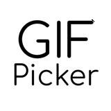
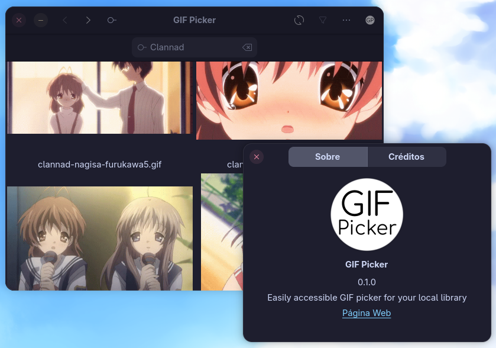

# Project GIF Picker


This GTK app pretends to be a small but effective tool to have a local GIF library easily accessible. It allows the user to copy the pretended GIF to the clipboard, as well as to search through the library, to effectively go through large folders.

## Screenshots



## Building
Generically, the process uses Ninja, Meson and valac, so make sure to have these installed. As for the commands themselves, make sure to have the necessary dependencies installed and build the Meson project as normal.

### Fedora Linux and derivatives

To install meson, ninja and valac, do:
```sudo dnf install meson ninja ninja-build pkgconf valac```

Next, you will need to install the dependecies that the program requires. Install them with the following command.
```sudo dnf install gtk4-devel glib2-devel```

From there, on the project's main folder, do:
```meson setup <your build directory e.g. builddir>```

Next do ```cd <your build directory e.g. builddir>``` followed by ```ninja``` or ```meson compile```.

To install it permanently on your system, run:
```meson install -C <your build directory>```

